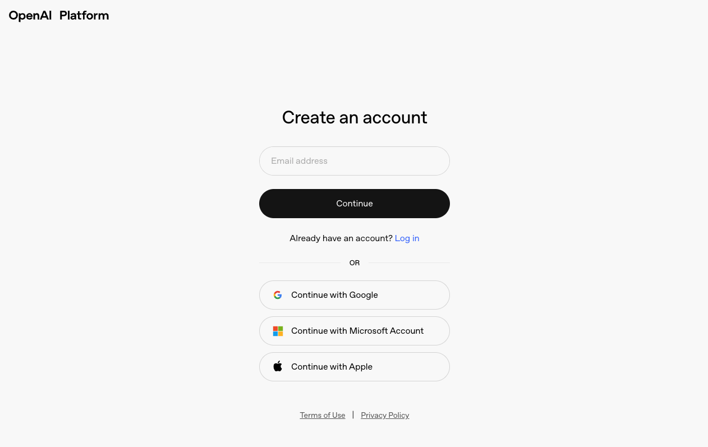
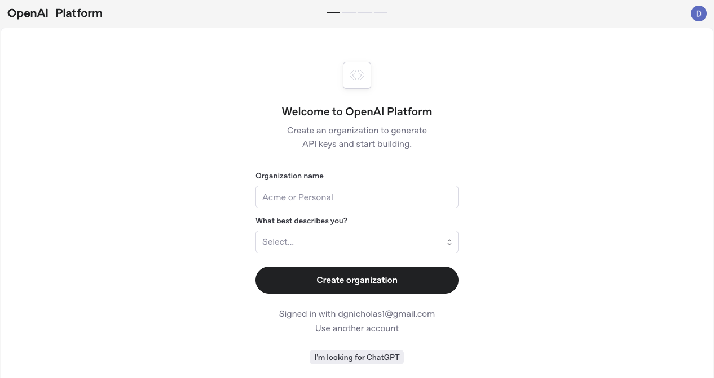

<div align="center">
  <h1>Using AI Component Paste with Next.js</h1>
</div>

> [!Warning]
>
> 🚧 Under Construction 🚧

## Overview

This guide demonstrates how to integrate `@bitovi/ai-component-paste` with a Next.js application to build an intelligent recipe tracking system. You'll learn how to create a form that leverages AI to automatically extract and categorize recipe information from copied text. By the end of this tutorial, you'll have a functional application that allows users to simply copy recipe content from any website and instantly save structured recipe data with minimal manual input.

[image of finished app]

## Setup

To get started we'll bootstrap a Next.js app using [`create-next-app`](https://nextjs.org/docs/app/api-reference/cli/create-next-app) using all the default settings

```sh
npx create-next-app@latest ai-paste-recipe-tracker --yes
```

Move into the project and install the `@bitovi/ai-component-paste` package

```sh
cd ai-paste-recipe-tracker
npm install @bitovi/ai-component-paste
```

Next we need to setup the required environment variables, mainly, the `OPEN_AI_KEY` which will link `ai-component-paste` to your open ai account.

If this isn't your first time building with OpenAI you can skip to the "Creating a Secret Key" Section

### Creating an OpenAI Account

First, [create an OpenAI account](https://auth.openai.com/create-account)



Once logged in, click "Start building"


Next, you will need to complete a wizard starting with defining your organization. An organization is just an entity you can create projects under.



**Configure Environment Variables**

- Setting up OpenAI API key
- Creating .env file
- Security considerations

## Setting Up the API Endpoint

1. **Create API Route**
   - Add OpenAI setup
   - Implement extraction logic

## Building the Recipe Form

1. **Create Form Component**

   - Basic form structure
   - Input fields for recipe data
   - Styling considerations

2. **Integrate AI Component Paste**

   - Import and configure the component
   - Connect to API endpoint
   - Handle events

## Handling AI-Extracted Data

1. **Event Handling**

   - Processing extracted data
   - Form state management
   - Error handling

2. **Enhancing Extraction Logic**
   - Tuning for specific recipe formats
   - Improving accuracy
