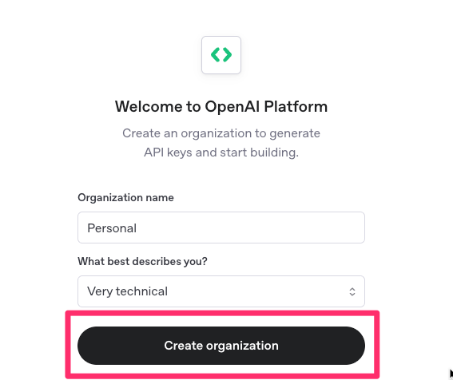

<div align="center">
  <h1>Creating an OpenAI Key</h1>
</div>

> [!Warning]
>
> 🚧 Under Construction 🚧

## Overview

This guide walks you through the process of creating and configuring an OpenAI API key for use with `@bitovi/ai-component-paste`. You'll learn how to set up an OpenAI account, create an organization, generate an API key, and properly configure it in your application.

This guide offers two paths:

- **New OpenAI Users**: If you don't have an OpenAI account yet, follow the guide from the beginning.
- **Existing OpenAI Users**: If you already have an OpenAI account, you can [skip to the "With a Previous Existing OpenAI Account" section](#with-a-previous-existing-openai-account).

By following these steps, you'll have everything needed to power the AI capabilities of the component and enable intelligent form filling in your projects.

## New OpenAI Users

### Creating an Account

First, [create an OpenAI account](https://auth.openai.com/create-account)

<div align="center">
  
</div>

Once logged in, click "Start building"

<div align="center">
  
</div>

### Setting Up Your Organization

Next, you'll be guided through a setup wizard where you'll first create an organization. In OpenAI, an organization serves as a workspace where you can manage API keys, track usage, and organize your AI projects.

<div align="center">
  
</div>

You can name your organization whatever you want and fill in your own level of technicality. Once filled out, click "Create Organization"

<div align="center">
  
</div>

Next it will ask if you want to invite your team. This can be skipped by clicking the "I'll invite my team later" button.

<div align="center">
  
</div>

### Generating an API Key

Then it will ask you to create and generate a project and key, fill out the form giving the API key and project a name and click "Generate API Key".

<div align="center">
  
</div>

The wizard will give you your key, copy it and place it in your `.env` file keyed by `OPENAI_API_KEY`

<div align="center">
  
</div>

### Configuring Your Application

Once you have your API key, you need to add it to your **backend application**'s environment variables:

> [!IMPORTANT]
> Never commit your API key to version control. Always use environment variables or a secure secrets management system.

```bash
# .env file
OPENAI_API_KEY=sk-your-copied-key-here
```

### Buying Credits

Next, you'll need to select how many API credits you'd like to purchase. The recommended amount will work fine for this project. Click "Purchase Credits" to proceed.

<div align="center">
  
</div>

This will open a payment modal. Fill out your payment information and click "Add payment method".

<div align="center">
  
</div>

With that, you are all set to fully leverage `@bitovi/ai-component-paste`!

## With a Previous Existing OpenAI Account

If you already have an OpenAI account, visit [https://platform.openai.com/api-keys](https://platform.openai.com/api-keys) and select the project you'd like to create the key for.

<div align="center">
  
</div>

Then click "Create new secret key".

<div align="center">
  
</div>

Name your key with something descriptive.

<div align="center">
  
</div>

And click "Create secret key".

<div align="center">
  
</div>

Copy your new secret key. Note that you won't be able to view this key again after closing this window.

<div align="center">
  
</div>

### Configuring Your Application

Once you have your API key, you need to add it to your **backend application**'s environment variables:

> [!IMPORTANT]
> Never commit your API key to version control. Always use environment variables or a secure secrets management system.

```bash
# .env file
OPENAI_API_KEY=sk-your-copied-key-here
```

With that, you are all set to fully leverage `@bitovi/ai-component-paste`!
