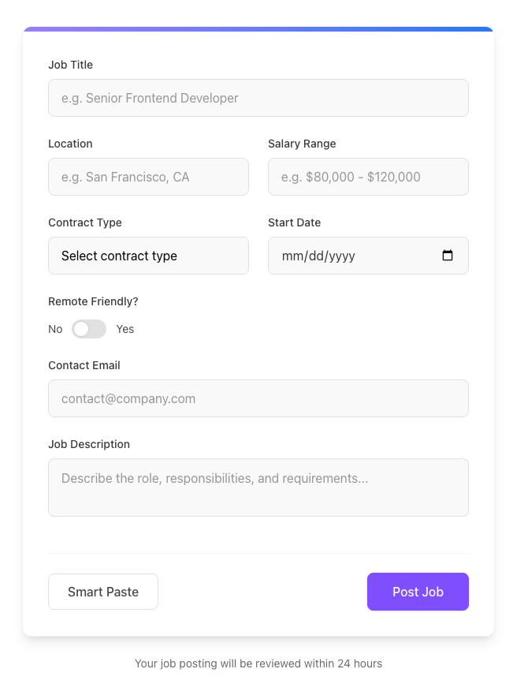
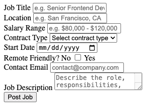
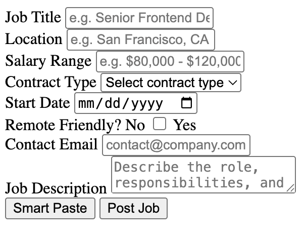
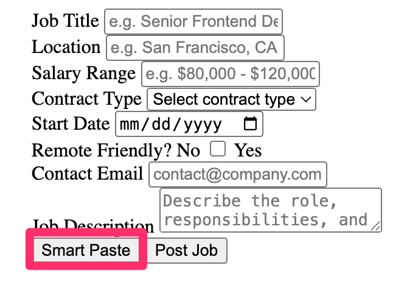
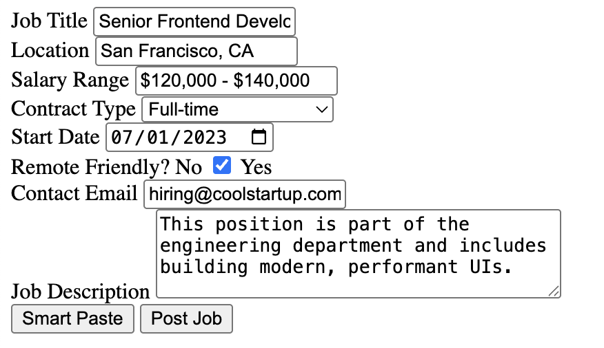
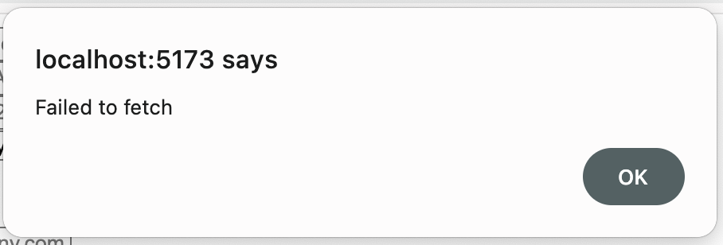

<div align="center">
  <h1>Using AI Component Paste with Vanilla and Express</h1>
</div>

> [!Warning]
>
> 🚧 Under Construction 🚧

## Overview

This guide demonstrates how to integrate `@bitovi/ai-component-paste` with a Vanilla and Express application to build an intelligent Job Post form. You'll learn how to create a form that leverages AI to automatically extract and categorize job posting information from copied text. By the end of this tutorial, you'll have a functional form that allows users to simply copy text from any source (slack message, email, etc.) and fill out a form to create the job posting.

<div align="center">
  
</div>

## The Backend

We'll begin by setting up the backend of our application using Express and TypeScript. This server will host the AI extraction endpoint used by the `<ai-paste>` component to parse and map clipboard text into form field values.

### Project Configuration

To get started we will bootstrap an express application with TypeScript.

```sh
mkdir ai-component-paste-be
cd ai-component-paste-be
npm init -y
npm install express cors
npm install typescript tsx @types/node @types/express @types/cors --save-dev
```

Next we'll need to create a `tsconfig.json` file that's setup for a node environment, this can be done by running

```sh
npx tsc --init

```

and replacing the content of the newly create `tsconfig.json` file with

```json
{
  "compilerOptions": {
    "target": "ESNext",
    "module": "ESNext",
    "moduleResolution": "Bundler",
    "outDir": "./dist",
    "strict": true,
    "esModuleInterop": true,
    "skipLibCheck": true,
    "forceConsistentCasingInFileNames": true
  },
  "include": ["src/**/*.ts"],
  "exclude": ["node_modules"]
}
```

Next, update the `package.json` to include scripts for building and running your application. You can remove the default `"test"` script and replace the entire `"scripts"` section with the following:

```diff
{
  // ... rest of package.json
  "scripts": {
-   "test": "echo \"Error: no test specified\" && exit 1"
+   "build": "tsc",
+   "start": "node --env-file=.env dist/index.js",
+   "dev": "tsx --env-file=.env src/index.ts"
  }
}
```

Additionally, we want to set the `"type"` to `"module"`.

```json
{
  "name": "ai-component-paste-be",
  "version": "1.0.0",
  "main": "index.js",
  "type": "module",
  "scripts": {
    "build": "tsc",
    "start": "node --env-file=.env dist/index.js",
    "dev": "tsx --env-file=.env src/index.ts"
  },
  "keywords": [],
  "author": "",
  "license": "ISC",
  "description": "",
  "dependencies": {
    "@bitovi/ai-component-paste": "^0.0.5",
    "cors": "^2.8.5",
    "express": "^5.1.0"
  },
  "devDependencies": {
    "@types/cors": "^2.8.17",
    "@types/express": "^5.0.1",
    "@types/node": "^22.14.1",
    "tsx": "^4.19.3",
    "typescript": "^5.8.3"
  }
}
```

We need to create two files. Open the project in a code editor and create:

1. `.env` to house our environment
2. `src/index.ts` to house our server

Once done, your project should look like this:

```
└── node_modules
├── src/
│   └── index.ts (this file is empty)
└── .env (this file is)
└── package.json
└── package-lock.json
└── tsconfig.json
```

With our project scaffolded and development scripts in place, we're ready to build the Express server that will handle AI-powered form extraction.

### Building the Server

Next, we'll need to create the server itself. Open the `src/index.ts` file and add teh following code:

```ts
import express, { Request, Response } from "express";
import cors from "cors";

const app = express();
const port = 3000;

// The frontend will run on port :5173
app.use(cors({ origin: ["http://localhost:5173"] }));
app.use(express.json());

app.get("/", (req: Request, res: Response) => {
  res.send("Hello World!");
});

app.listen(port, () => {
  console.log(`@bitovi/ai-component-paste example app listening on port ${port}`);
});
```

You can verify your setup is correct by running:

```sh
npm run dev
```

you should see a `"@bitovi/ai-component-paste example app listening on port 3000"` in the terminal and if you visit `http://localhost:3000` in your browser you should see "Hello World!". Once verified you can delete the `app.get("/", ...)` from `src/index.ts`

```diff

import express, { Request, Response } from "express";
import cors from "cors";

const app = express();
const port = 3000;

app.use(cors({ origin: ["http://localhost:5173"] }));
app.use(express.json());

-app.get("/", (req: Request, res: Response) => {
-   res.send("Hello World!");
-});

app.listen(port, () => {
  console.log(`@bitovi/ai-component-paste example app listening on port ${port}`);
});
```

Now that we've confirmed our server is up and running, let's integrate the AI extraction logic using `@bitovi/ai-component-paste`.

### Integrating `@bitovi/ai-component-paste`

Next we can install and use `@bitovi/ai-component-paste`

```sh
npm install @bitovi/ai-component-paste
```

We'll also need to configure our environment. In the `.env` file you created earlier, add your OpenAI API key:

> [!NOTE]
>
> Need help creating an OpenAI key? Check out [our guide to getting one](../open-ai-key)
> to help you get set up.

```
OPENAI_API_KEY=your-openai-key-here
```

> [!WARNING]
>
> We aren't using git in this guide, but if you are, make sure not to
> commit this file to version control.

### Creating the Extraction Endpoint

Next, we'll define a `POST` endpoint that the `<ai-paste>` component can call. This endpoint will receive clipboard text along with scraped form field metadata and return the AI-generated form values.

We'll call this route `/extract-form-data` and the request body should include:

- **text** - the clipboard content
- **fields** - the list of form fields scraped from the page

```ts
import type { FormField } from "@bitovi/ai-component-paste/extractor";

interface AIComponentPasteRequestBody {
  text: string;
  fields: FormField[];
}
```

With the request shape defined, let's build the Express route that will handle incoming data from `<ai-paste>`, pass it to the AI model, and return the structured result. `extractFormData` takes care of calling the LLM and returning structured values that match your form fields.

```ts
import { extractFormData, FormField } from "@bitovi/ai-component-paste/extractor";

interface AIComponentPasteRequestBody {
  text: string;
  fields: FormField[];
}

// other parts of the file omitted for brevity

app.post("/extract-form-data", async (req: Request<{}, {}, AIComponentPasteRequestBody>, res: Response) => {
  const { text, fields } = req.body;

  try {
    const result = await extractFormData(text, fields);

    res.json(result);
  } catch (error) {
    console.error("Error extracting form data:", error);
    res.status(500).json({ error: "Failed to extract form data" });
  }
});

// other parts of the file omitted for brevity
```

With the backend in place and ready to handle extraction requests, we can now move on to building the frontend form and wiring up the `<ai-paste>` component.

## The Frontend

We'll use [Vite](https://vitejs.dev/) to scaffold a lightweight frontend project using plain HTML and TypeScript. This will serve the form that includes the `<ai-paste>` component.

Start by creating a new Vite project:

```sh
npm create vite@latest ai-component-paste-fe
```

When prompted, choose:

- Framework: `Vanilla`
- Variant: `TypeScript`

Then install your dependencies:

```sh
cd ai-component-paste-fe
npm install
```

### Cleaning Up the Starter Files

Before we add our custom code, let's remove the boilerplate that comes with Vite. Open the project in your editor and:

1. Clear out `main.ts` - Open `src/main.ts` and delete everything inside. We'll replace this with an import of the `@bitovi/ai-component-paste` package in a later step.

2. Clear out `styles.css` - Open `src/styles.css` and delete everything inside. While we're getting the component added, were going to avoid styling, at the end, html with the needed tailwind class names will be provided

3. Delete `counter.ts` - You won't need the sample counter functionality.

4. Delete `typescript.svg` - You won't need the TypeScript logo.

With the boilerplate removed, your frontend project is now ready for the form and AI integration.

### Adding the Form

Now we can update the contents of `index.html` to include the job post form. Inside the `<div id="app">`, add the following markup:

```html
<form>
  <div>
    <div>
      <label for="title">Job Title</label>
      <input id="title" name="title" placeholder="e.g. Senior Frontend Developer" />
    </div>

    <div>
      <label for="location">Location</label>
      <input id="location" name="location" placeholder="e.g. San Francisco, CA" />
    </div>

    <div>
      <label for="salary">Salary Range</label>
      <input id="salary" name="salary" placeholder="e.g. $80,000 - $120,000" />
    </div>

    <div>
      <label for="contractType">Contract Type</label>
      <select id="contractType" name="contractType">
        <option value="" selected disabled>Select contract type</option>
        <option value="full-time">Full-time</option>
        <option value="part-time">Part-time</option>
        <option value="contract">Contract</option>
        <option value="internship">Internship</option>
      </select>
    </div>

    <div>
      <label for="startDate">Start Date</label>
      <input type="date" id="startDate" name="startDate" />
    </div>

    <div>
      <label>Remote Friendly?</label>
      <label>
        <span>No</span>
        <input type="checkbox" id="remote" name="remote" />
        <span>Yes</span>
      </label>
    </div>

    <div>
      <label for="email">Contact Email</label>
      <input type="email" id="email" name="email" placeholder="contact@company.com" />
    </div>

    <div>
      <label for="description">Job Description</label>
      <textarea
        id="description"
        name="description"
        placeholder="Describe the role, responsibilities, and requirements..."
      ></textarea>
    </div>
  </div>

  <div>
    <button type="submit">Post Job</button>
  </div>
</form>
```

Once added, you should be able to start the dev sever:

```sh
npm run dev
```

Then navigate to `http://localhost:5173` — you should see an unstyled form rendered in the browser.

<div align="center">
  
</div>

### Integrating `@bitovi/ai-component-paste`

Now let's bring the form to life by wiring up the `<ai-paste>` component so it can scrape the form, read the clipboard, and call our backend.

First, install the component package:

```sh
npm install @bitovi/ai-component-paste
```

Then open `src/main.ts` and add the following import to register the web component:

```ts
import "@bitovi/ai-component-paste/component";
```

Now, wire it up to your backend by setting the `api` attribute in `index.html`. Update the `<ai-paste>` element to point to your local extraction endpoint:

```html
<div>
  <ai-paste api="http://localhost:3000/extract-form-data"></ai-paste>
  <button type="submit">Post Job</button>
</div>
```

<div align="center">
  
</div>

That's it! When users paste text into the page and click the AI Paste button, the component will:

- Scrape the form fields
- Read clipboard contents
- Send everything to your Express backend
- Fill in matching fields with AI-generated values

## Running the Full App

Make sure both the frontend and backend projects are running. From the `ai-component-paste-be directory`:

```sh
npm run dev
```

From the `ai-component-paste-fe directory`:

```sh
npm run dev
```

Once both are running, copy the text below and click the AI Paste button in your form:

```
We're hiring a Senior Frontend Developer in San Francisco, CA. The role is full-time and remote friendly, with a salary range between $120,000 and $140,000. Ideally, the candidate starts on July 1st. They can reach out to hiring@coolstartup.com with any questions. This position is part of the engineering department and includes building modern, performant UIs.
```

<div align="center">
  
</div>

Once pasted the form should be filled out, AI is non-deterministic so it might not be the same as the image below, but it should look similar

<div align="center">
  
</div>

## Improvements to the App

At this point, you have a working integration! If you're just looking for a basic copy-to-form experience, you're good to go.

However, if you want to level up your app with better error handling, helpful field descriptions, and basic styling — read on.

## Error Handling

If something goes wrong during extraction — like a network issue or a missing API key — the `<ai-paste>` component will emit a custom `ai-paste-error` event container an `Error` in the `detail`.

You can listen for this event to surface meaningful feedback to users. For example, let's display a simple alert when something fails.

Open `src/main.ts` in the frontend project and add an event listener on `<ai-paste>`.

```ts
const isAIPasteError = (event: Event): event is CustomEvent<Error> => {
  return "detail" in event && event.detail instanceof Error;
};

document.querySelector("ai-paste")?.addEventListener("ai-paste-error", (event) => {
  if (isAIPasteError(event)) {
    alert(event.detail.message);
  }
});
```

You can test this by stopping the backend and trying to paste again. You should see an alert like.

<div align="center">
  
</div>

## Adding Descriptions

Sometimes, a field name alone isn't enough for the AI to understand how to fill it correctly — especially for inputs like dates or open-ended fields like job descriptions. To help the model make more accurate decisions, you can add `data-sp-description` attributes to your form fields. These descriptions are sent to the AI as context and can dramatically improve extraction accuracy.

For the start date, you can clarify the expected format by updating the `<input name='startDate'>` in `index.html`.

```html
<input type="date" id="startDate" name="startDate" data-sp-description="All responses must be in YYYY-mm-dd format" />
```

For larger, freeform fields, you can help the AI understand what kind of content to generate. For example, we can update the `<textarea name="description">` in `index.html` to include writing full sentences and even how to start the description.

```html
<textarea
  id="description"
  name="description"
  data-sp-description="Contains details about what the hired employee will do at the job. Responses should be full sentences about job starting with an ideal candidate..."
></textarea>
```

## Styling

To improve the look and feel of the form (and to match the screenshot at the beginning), we can add Tailwind CSS to the frontend project. In the frontend project run:

```sh
npm install tailwindcss @tailwindcss/vite
```

Then create a `vite.config.ts` file at the root of the project and add the following code.

```ts
import { defineConfig } from "vite";
import tailwindcss from "@tailwindcss/vite";

export default defineConfig({
  plugins: [tailwindcss()],
});
```

Next, in the empty `src/style.css` add the following tailwind directive.

```css
@import "tailwindcss";
```

Finally, we need to import our css. This has to be done in two places. First, At the top of `src/main.ts`

```diff
import "@bitovi/ai-component-paste/component";
+ import "./style.css";

const isAIPasteError = (event: Event): event is CustomEvent<Error> => {
  return "detail" in event && event.detail instanceof Error;
};

document.querySelector("ai-paste")?.addEventListener("ai-paste-error", (event) => {
  if (isAIPasteError(event)) {
    alert(event.detail.message);
  }
});
```

Second, in the `<head>` of `index.html`.

```diff
<head>
  <meta charset="UTF-8" />
  <link rel="icon" type="image/svg+xml" href="/vite.svg" />
  <meta name="viewport" content="width=device-width, initial-scale=1.0" />
+ <link href="/src/styles.css" rel="stylesheet">
  <title>Vite + TS</title>
</head>
```

With tailwind setup you can style your form however you'd like, to match the screenshot above use the following `<form>`

```html
<!-- Paste this inside <div id="app"> -->
<div class="w-full lg:w-[600px]">
  <div class="flex-1 bg-white rounded-xl shadow-lg overflow-hidden border border-neutral-100">
    <div class="h-1.5 w-full bg-neutral-100">
      <div class="h-full w-full bg-gradient-to-r from-violet-400 to-blue-500 rounded-r-full"></div>
    </div>
    <form class="p-8">
      <div class="grid grid-cols-1 md:grid-cols-2 gap-6">
        <div class="space-y-2 md:col-span-2">
          <label htmlFor="title" class="block text-sm font-medium text-neutral-700"> Job Title </label>
          <input
            id="title"
            name="title"
            class="w-full h-12 px-4 bg-neutral-50 border border-neutral-200 rounded-lg focus:border-violet-500 focus:ring-1 focus:ring-violet-500 focus:outline-none transition-colors placeholder-neutral-400"
            placeholder="e.g. Senior Frontend Developer"
          />
        </div>

        <div class="space-y-2">
          <label htmlFor="location" class="block text-sm font-medium text-neutral-700"> Location </label>
          <input
            id="location"
            name="location"
            class="w-full h-12 px-4 bg-neutral-50 border border-neutral-200 rounded-lg focus:border-violet-500 focus:ring-1 focus:ring-violet-500 focus:outline-none transition-colors placeholder-neutral-400"
            placeholder="e.g. San Francisco, CA"
          />
        </div>

        <div class="space-y-2">
          <label htmlFor="salary" class="block text-sm font-medium text-neutral-700"> Salary Range </label>
          <input
            id="salary"
            name="salary"
            class="w-full h-12 px-4 bg-neutral-50 border border-neutral-200 rounded-lg focus:border-violet-500 focus:ring-1 focus:ring-violet-500 focus:outline-none transition-colors placeholder-neutral-400"
            placeholder="e.g. $80,000 - $120,000"
          />
        </div>

        <div class="space-y-2">
          <label htmlFor="contractType" class="block text-sm font-medium text-neutral-700"> Contract Type </label>
          <div class="relative">
            <select
              id="contractType"
              name="contractType"
              class="w-full h-12 px-4 bg-neutral-50 border border-neutral-200 rounded-lg focus:border-violet-500 focus:ring-1 focus:ring-violet-500 focus:outline-none transition-colors appearance-none"
            >
              <option value="" selected disabled>Select contract type</option>
              <option value="full-time">Full-time</option>
              <option value="part-time">Part-time</option>
              <option value="contract">Contract</option>
              <option value="internship">Internship</option>
            </select>
            <div class="absolute right-3 top-3.5 text-neutral-400 pointer-events-none"></div>
          </div>
        </div>

        <div class="space-y-2">
          <label htmlFor="startDate" class="block text-sm font-medium text-neutral-700"> Start Date </label>
          <input
            type="date"
            id="startDate"
            name="startDate"
            data-sp-description="All responses must be in YYYY-mm-dd format"
            class="w-full h-12 px-4 bg-neutral-50 border border-neutral-200 rounded-lg focus:border-violet-500 focus:ring-1 focus:ring-violet-500 focus:outline-none transition-colors text-neutral-700"
          />
        </div>

        <div class="space-y-2">
          <label class="block text-sm font-medium text-neutral-700 mb-3">Remote Friendly?</label>
          <label class="inline-flex items-center cursor-pointer">
            <span class="mr-3 text-sm text-neutral-600">No</span>
            <div class="relative">
              <input type="checkbox" id="remote" name="remote" class="sr-only peer" />
              <div
                class="w-11 h-6 bg-neutral-200 rounded-full peer peer-focus:ring-2 peer-focus:ring-violet-100 peer-checked:after:translate-x-full peer-checked:after:border-white after:content-[''] after:absolute after:top-0.5 after:left-[2px] after:bg-white after:border-neutral-300 after:border after:rounded-full after:h-5 after:w-5 after:transition-all peer-checked:bg-violet-500"
              ></div>
            </div>
            <span class="ml-3 text-sm text-neutral-600">Yes</span>
          </label>
        </div>

        <div class="space-y-2 md:col-span-2">
          <label htmlFor="email" class="block text-sm font-medium text-neutral-700"> Contact Email </label>
          <input
            type="email"
            id="email"
            name="email"
            class="w-full h-12 px-4 bg-neutral-50 border border-neutral-200 rounded-lg focus:border-violet-500 focus:ring-1 focus:ring-violet-500 focus:outline-none transition-colors placeholder-neutral-400"
            placeholder="contact@company.com"
          />
        </div>

        <div class="space-y-2 md:col-span-2">
          <label htmlFor="description" class="block text-sm font-medium text-neutral-700"> Job Description </label>
          <textarea
            id="description"
            name="description"
            data-sp-description="Contains details about what the hired employee will do at the job. Responses should be full sentences about job starting with an ideal candidate..."
            class="w-full px-4 py-3 bg-neutral-50 border border-neutral-200 rounded-lg focus:border-violet-500 focus:ring-1 focus:ring-violet-500 focus:outline-none transition-colors placeholder-neutral-400 resize-none"
            placeholder="Describe the role, responsibilities, and requirements..."
          ></textarea>
        </div>
      </div>

      <div class="mt-10 flex justify-between items-center border-t border-neutral-100 pt-6">
        <ai-paste
          class="px-6 py-2.5 border border-neutral-200 text-neutral-600 font-medium rounded-lg hover:bg-neutral-50 transition-colors hover:cursor-pointer"
        ></ai-paste>

        <button
          type="submit"
          class="px-8 py-3 bg-violet-500 text-white font-medium rounded-lg shadow-sm hover:bg-blue-600 transition-colors hover:cursor-pointer"
        >
          Post Job
        </button>
      </div>
    </form>
  </div>
  <div class="mt-6 text-center text-neutral-500 text-sm">Your job posting will be reviewed within 24 hours</div>
</div>
```

That's it — you now have a fully functional, AI-powered job posting form, styled with Tailwind, backed by Express,
and ready to save your users hours of manual entry.

<div align="center">
  
</div>
